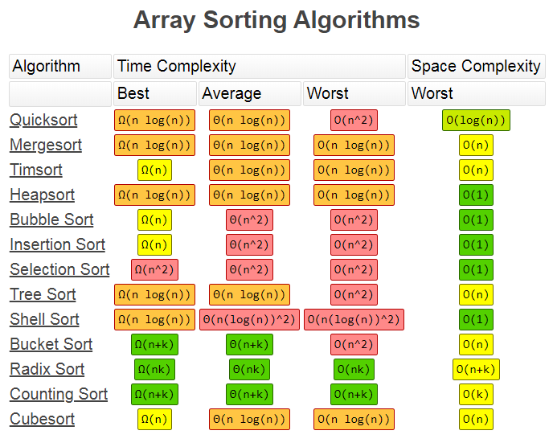
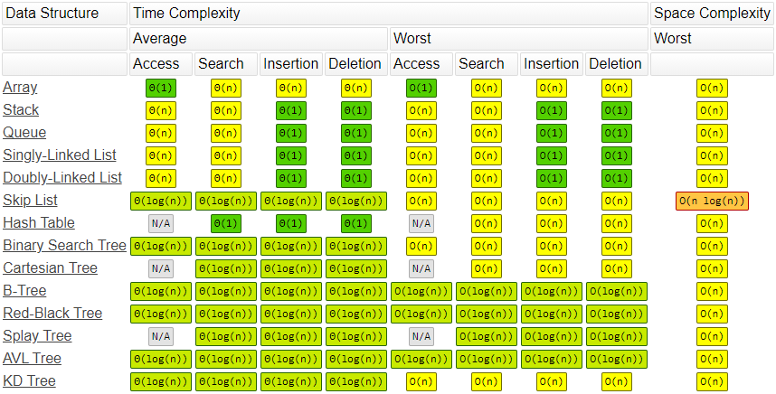
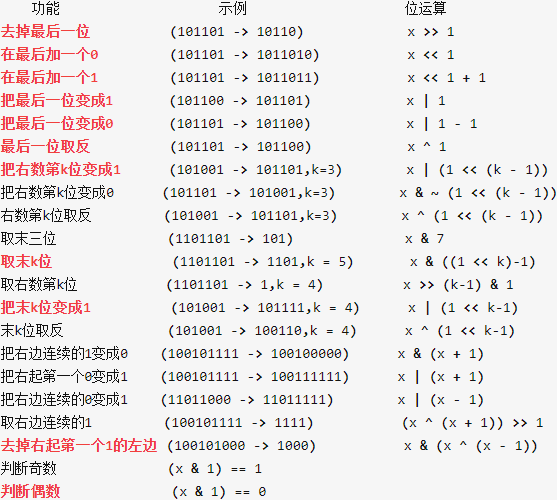

[对比](https://www.bigocheatsheet.com/)  
[十大经典排序算法（动图演示）](https://www.cnblogs.com/onepixel/p/7674659.html)  
[优质博客](https://www.zdaiot.com/DataStructureAlgorithm/01%E6%95%B0%E6%8D%AE%E7%BB%93%E6%9E%84%E4%B8%8E%E7%AE%97%E6%B3%95%E7%AE%80%E4%BB%8B/)  
排序  
  
```
归并
// JavaScript
const mergeSort = (nums) => {
  if (nums.length <= 1) return nums
  let mid = Math.floor(nums.length/2), 
      left = nums.slice(0, mid), 
      right = nums.slice(mid)
  return merge(mergeSort(left), mergeSort(right))
}

const merge = (left, right) => {
  let result = []
  while(left.length && right.length) {
    result.push(left[0] <= right[0] ? left.shift() : right.shift())
  }
  while(left.length) result.push(left.shift())
  while(right.length) result.push(right.shift())
  return result
}
```   
```
快排
// JavaScript
const quickSort = (nums, left, right) => {
  if (nums.length <= 1) return nums
  if (left < right) {
    index = partition(nums, left, right)
    quickSort(nums, left, index-1)
    quickSort(nums, index+1, right)
  }
}
      
const partition = (nums, left, right) => {
  let pivot = left, index = left + 1
  for (let i = index; i <= right; i++) {
    if (nums[i] < nums[pivot]) {
      [nums[i], nums[index]] = [nums[index], nums[i]]
      index++
    }
  }
  [nums[pivot], nums[index-1]] = [nums[index-1], nums[pivot]]
  return index -1
}
```   
```
堆排
// Javascript
function heapSort(arr) {
  if (arr.length === 0) return;
  let len = arr.length;
  // 建堆
  for (let i = Math.floor(len / 2) - 1; i >= 0; i--) {
    heapify(arr, len, i);
  }
  // 排序
  for (let i = len - 1; i >= 0; i--) {
    // 堆顶元素与最后一个互换
    [arr[0], arr[i]] = [arr[i], arr[0]];
    // 对 0 ～ i 的数组建堆
    heapify(arr, i, 0);
  }
}
function heapify(arr, len, i) {
  let left = i * 2 + 1;
  let right = i * 2 + 2;
  let largest = i;
  if (left < len && arr[left] > arr[largest]) {
    largest = left;
  }
  if (right < len && arr[right] > arr[largest]) {
    largest = right;
  }
  if (largest !== i) {
    [arr[i], arr[largest]] = [arr[largest], arr[i]];
    heapify(arr, len, largest);
  }
}
```
结构  
  
位运算  
  
递归  
```
// JavaScript
const recursion = (level, params) =>{
   // recursion terminator
   if(level > MAX_LEVEL){
     process_result
     return 
   }
   // process current level
   process(level, params)
   //drill down
   recursion(level+1, params)
   //clean current level status if needed
   
}
```  
分治  
```
//Javascript
const divide_conquer = (problem, params) => {

  // recursion terminator

  if (problem == null) {

    process_result

    return

  } 

  // process current problem

  subproblems = split_problem(problem, data)

  subresult1 = divide_conquer(subproblem[0], p1)

  subresult2 = divide_conquer(subproblem[1], p1)

  subresult3 = divide_conquer(subproblem[2], p1)

  ...

  // merge

  result = process_result(subresult1, subresult2, subresult3)

  // revert the current level status

}
```
二叉树
```

```   
二分查找  
```
/* JavaScript */
let left = 0, right = len(array) - 1
while (left <= right) {
  let mid = (left + right) >> 1
  if (array[mid] === target) { /*find the target*/; return }
  else if (array[mid] < target) left = mid + 1
  else right = mid - 1
}
```  
动态规划  
```
// JavaScript
const recursion = (level, params) =>{
   // recursion terminator
   if(level > MAX_LEVEL){
     process_result
     return 
   }
   // process current level
   process(level, params)
   //drill down
   recursion(level+1, params)
   //clean current level status if needed
   
}
```   
trie树  
```
// JavaScript
class Trie {
  constructor() {
    this.root = {};
    this.endOfWord = "$";
  }

  insert(word) {
    let node = this.root;
    for (let ch of word) {
      node[ch] = node[ch] || {};
      node = node[ch];
    }
    node[this.endOfWord] = this.endOfWord;
  }

  search(word) {
    let node = this.root;
    for (let ch of word) {
      if (!node[ch]) return false;
      node = node[ch];
    }
    return node[this.endOfWord] === this.endOfWord;
  }

  startsWith(word) {
    let node = this.root;
    for (let ch of word) {
      if (!node[ch]) return false;
      node = node[ch];
    }
    return true;
  }
}


let trie = new Trie();
console.log(trie.insert("apple"));
console.log(trie.search("apple")); // 返回 true
console.log(trie.search("app")); // 返回 false
console.log(trie.startsWith("app")); // 返回 true
console.log(trie.insert("app"));
console.log(trie.search("app")); // 返回 true
```   
并查集  
```
// JavaScript
class unionFind {
  constructor(n) {
    this.count = n;
    this.parent = new Array(n);
    for (let i = 0; i < n; i++) {
      this.parent[i] = i;
    }
  }

  find(p) {
    let root = p;
    while (parent[root] !== root) {
      root = parent[root];
    }
    // 压缩路径
    while (parent[p] !== p) {
      let x = p;
      p = this.parent[p];
      this.parent[x] = root;
    }
    return root;
  }

  union(p, q) {
    let rootP = find(p);
    let rootQ = find(q);
    if (rootP === rootQ) return;
    this.parent[rootP] = rootQ;
    this.count--;
  }
}
```
A*  
```
// Javascript
function aStarSearch(graph, start, end) {
  // graph 使用二维数组来存储数据
  let collection = new SortedArray([start], (p1, p2) => distance(p1) - distance(p2));

  while (collection.length) {
    let [x, y] = collection.take();
    if (x === end[0] && y === end[1]) {
      return true;
    }

    insert([x - 1, y]);
    insert([x + 1, y]);
    insert([x, y - 1]);
    insert([x, y + 1]);
  }
  return false;

  function distance([x, y]) {
    return (x - end[0]) ** 2 - (y - end[1]) ** 2;
  }

  function insert([x, y]) {
    if (graph[x][y] !== 0) return;
    if (x < 0 || y < 0 || x >= graph[0].length || y > graph.length) {
      return;
    }
    graph[x][y] = 2;
    collection.insert([x, y]);
  }
}


class SortedArray {
  constructor(data, compare) {
    this.data = data;
    this.compare = compare;
  }

  // 每次取最小值
  take() {
    let min = this.data[0];

    let minIndex = 0;
    for (let i = 1; i < this.data.length; i++) {
      if (this.compare(min, this.data[i]) > 0) {
        min = this.data[i];
        minIndex = i;
      }
    }
    this.data[minIndex] = this.data[this.data.length - 1];
    this.data.push();

    return min;
  }

  insert(value) {
    this.data.push(value);
  }

  get length() {
    return this.data.length;
  }
}
```  
n皇后位运算  
```
// Javascript
var totalNQueens = function(n) {
  let count = 0;
  void (function dfs(row = 0, cols = 0, xy_diff = 0, xy_sum = 0) {
    if (row >= n) {
      count++;
      return;
    }
    // 皇后可以放的地方
    let bits = ~(cols | xy_diff | xy_sum) & ((1 << n) - 1);
    while (bits) {
      // 保留最低位的 1
      let p = bits & -bits;
      bits &= bits - 1;
      dfs(row + 1, cols | p, (xy_diff | p) << 1, (xy_sum | p) >> 1);
    }
  })();
  return count;
};
```  
lru  
```
// JavaScript
class LRUCache {
  constructor(capacity) {
    this.capacity = capacity;
    this.cache = new Map();
  }

  get(key) {
    if (!this.cache.has(key)) return -1;
    
    let value = this.cache.get(key);
    this.cache.delete(key);
    this.cache.set(key, value);
  }

  put(key, value) {
    if (this.cache.has(key)) {
      this.cache.delete(key);
    } else {
      if (this.cache.size >= this.capacity) {
        // Map 中新 set 的元素会放在后面
        let firstKey = this.cache.keys().next();
        this.cache.delete(firstKey.value);
      }
    }
    this.cache.set(key, value);
  }
}
```  
atoi
```
// JavaScript
function myAtoi(str) {
  let index = 0;
  let sign = 1;
  let total = 0;
  // 1. Empty String
  if (str.length === 0) return 0;

  // 2. trim
  while (str[index] === " " && index < str.length) {
    index++;
  }

  // 3. get sign
  if (str[index] === "+" || str[index] === "-") {
    sign = str[index] === "+" ? 1 : -1;
    index++;
  }

  // 4. covert
  while (index < str.length) {
    let digit = str[index].codePointAt(0) - "0".codePointAt(0);
    if (digit < 0 || digit > 9) break;
    total = total * 10 + digit;
    index++;
  }

  if (sign * total > 2 ** 31 - 1) {
    return 2 ** 31 - 1;
  } else {
  }

  return Math.max(Math.min(sign * total, 2 ** 31 - 1), -(2 ** 31)
```